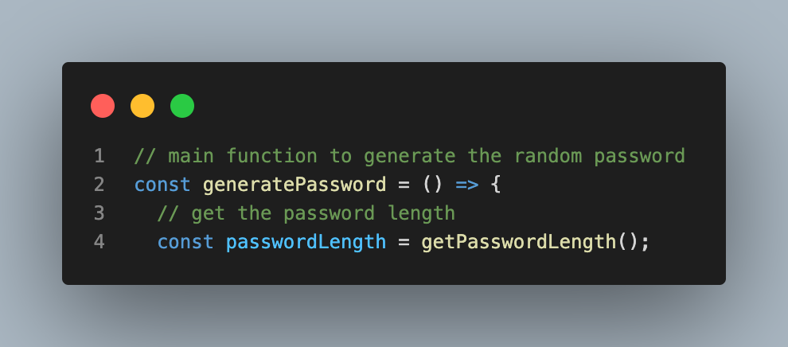
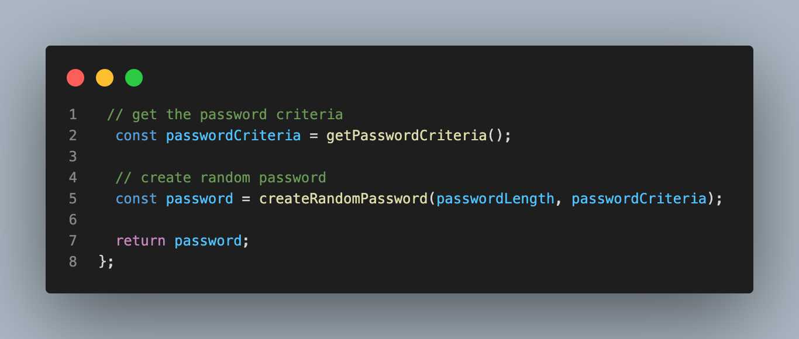
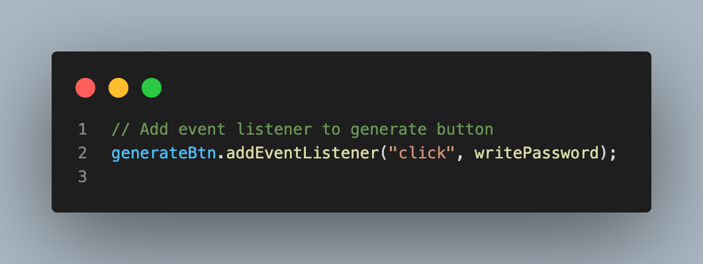

## Read Me

## Link to deployed GitHub Page

[GitHub Deployed link ](https://jonisd.github.io/password-generator/)

## Project Title: Password Generator

## Description

To create a password generator that creates random or customized passwords for users. It helps users create stronger passwords that provide greater security for a given type of access.

## Technologies

The technologies used for this respective project are HTML, CSS and Javascript.

## Screenshots:

Snippets of the code used in this Password Generator.

